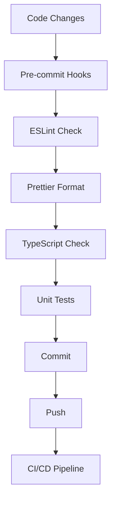
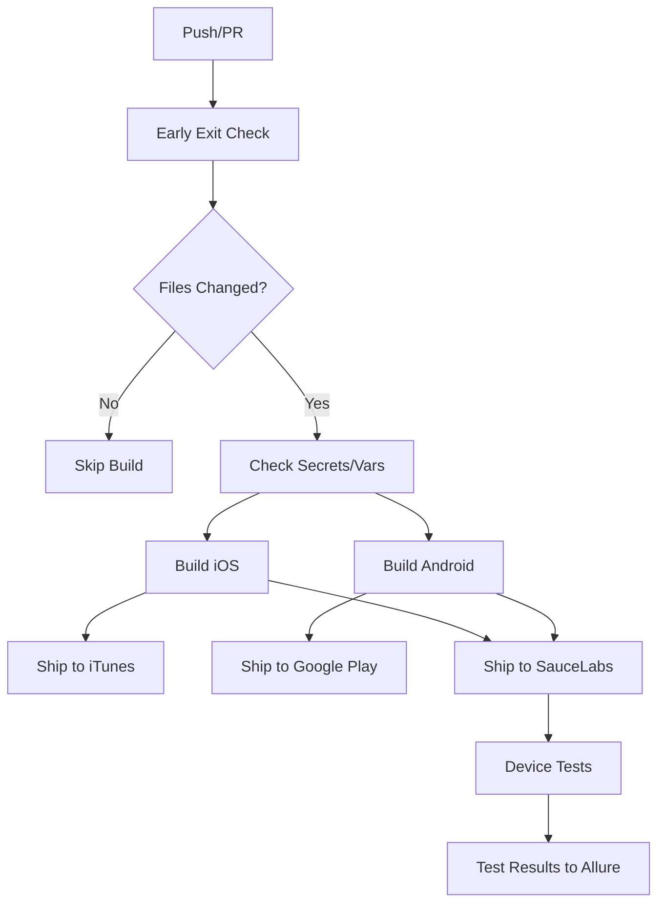

# BC Wallet Mobile - Development Workflows

## Overview

This document provides comprehensive development workflows and processes for the BC Wallet Mobile project. It serves as a machine-readable guide for AI systems to understand development practices, build processes, and contribution guidelines.

## Project Structure

```
bc-wallet-mobile/
├── .ai-documentation/          # AI-readable documentation
├── .github/                    # GitHub workflows and templates
│   ├── workflows/             # CI/CD workflows
│   ├── ISSUE_TEMPLATE/        # Issue templates
│   └── copilot-instructions.md # GitHub Copilot guidelines
├── app/                       # Main React Native application
│   ├── src/                   # Source code
│   │   ├── bcwallet-theme/    # BC Wallet theme
│   │   ├── bcsc-theme/        # BC Services Card theme
│   │   ├── components/        # Shared components
│   │   ├── screens/           # Screen components
│   │   ├── services/          # Business logic services
│   │   └── utils/             # Utility functions
│   ├── android/               # Android native code
│   ├── ios/                   # iOS native code
│   └── __tests__/             # Test files
├── packages/                  # Shared packages
│   └── bcsc-core/             # BCSC core functionality
├── docs/                      # Documentation assets
├── scripts/                   # Build and deployment scripts
└── devops/                    # DevOps configurations
```

## Development Environment Setup

### Prerequisites

1. **Node.js**: Version >=20.19.2 <21.0.0
2. **Package Manager**: Yarn 4.9.2 (managed via Corepack)
3. **Mobile Development**:
   - **Android**: Android SDK Platform 33, JDK, Gradle
   - **iOS**: Xcode, iOS 11+, Ruby 2.x.x
4. **Additional Tools**: Python 3.11.x, Bundler

### Initial Setup

```bash
# Clone repository
git clone https://github.com/bcgov/bc-wallet-mobile.git
cd bc-wallet-mobile

# Enable Corepack and install dependencies
corepack enable
yarn install

# Build BCSC core package
cd packages/bcsc-core
yarn build
cd ../..

# Setup iOS dependencies (macOS only)
cd app
yarn run ios:setup
cd ..
```

### Environment Configuration

1. Copy environment template: `cp app/.env.sample app/.env`
2. Configure required variables:
   ```
   LOAD_STORYBOOK=false
   OCA_URL=<overlay_capture_architecture_url>
   MEDIATOR_URL=<aries_mediator_url>
   MEDIATOR_USE_PUSH_NOTIFICATIONS=false
   PROOF_TEMPLATE_URL=<proof_template_service_url>
   REMOTE_LOGGING_URL=<remote_logging_service_url>
   INDY_VDR_PROXY_URL=<indy_vdr_proxy_url>
   ```

## Development Workflows

### Code Quality Workflow



### Available Scripts

| Command | Description | Usage |
|---------|-------------|-------|
| `yarn lint` | Run ESLint on codebase | Code quality check |
| `yarn prettier` | Check code formatting | Format validation |
| `yarn prettier:fix` | Fix formatting issues | Auto-format code |
| `yarn test` | Run Jest test suite | Unit testing |
| `yarn typecheck` | TypeScript type checking | Type validation |
| `yarn start` | Start Metro bundler | Development server |
| `yarn android` | Build and run Android | Android development |
| `yarn ios` | Build and run iOS | iOS development |

### Git Workflow

1. **Branching Strategy**: Feature branch workflow
2. **Commit Convention**: Conventional Commits format
   ```
   <type>[optional scope]: <description>
   
   Examples:
   feat(auth): implement biometric authentication
   fix(credentials): resolve verification issue
   docs(readme): update installation instructions
   ```
3. **Pre-commit Checks**: Automated via Husky
   - Linting with ESLint
   - Formatting with Prettier
   - Type checking with TypeScript
   - Unit tests with Jest

### Testing Strategy

#### Unit Testing
- **Framework**: Jest with React Native Testing Library
- **Coverage**: Aim for >80% code coverage
- **Location**: `app/__tests__/` and co-located test files
- **Command**: `yarn test`

#### Integration Testing
- **Framework**: Aries Mobile Test Harness
- **Platforms**: iOS and Android on SauceLabs
- **Scope**: End-to-end credential workflows
- **Automation**: GitHub Actions on main branch

#### Device Testing
- **Cloud Platform**: SauceLabs
- **Test Scenarios**: Smoke tests, credential flows
- **Devices**: Real iOS and Android devices
- **Frequency**: On every main branch deployment

## Build and Deployment

### Build Process

#### Android Build
```bash
# Debug build
cd app/android
./gradlew assembleDebug

# Release build (requires signing keys)
./gradlew bundleRelease
./gradlew assembleRelease
```

#### iOS Build
```bash
# Debug build
cd app
yarn ios

# Release build (requires certificates)
cd ios
xcodebuild -workspace AriesBifold.xcworkspace \
  -scheme AriesBifold \
  -configuration Release \
  archive
```

### CI/CD Pipeline

#### Workflow: `.github/workflows/main.yaml`



#### Build Stages

1. **Validation**:
   - Secret and variable checks
   - File change detection
   - Environment validation

2. **Build**:
   - iOS: Xcode build with certificate signing
   - Android: Gradle build with keystore signing
   - Artifact generation (.ipa, .aab, .apk)

3. **Deployment**:
   - App Store Connect (iOS)
   - Google Play Console (Android)
   - SauceLabs (testing platform)

4. **Testing**:
   - Device-based testing
   - Smoke test execution
   - Results reporting to Allure

### Environment Management

#### Development
- Local development with Metro bundler
- Hot reloading for rapid iteration
- Simulator/Emulator testing

#### Staging
- SauceLabs deployment for testing
- Integration with test Aries agents
- QA validation

#### Production
- App Store and Google Play releases
- Production Aries network integration
- User acceptance testing

## Code Architecture Guidelines

### Module Organization

1. **Separation of Concerns**: Clear boundaries between UI, business logic, and data
2. **Dependency Injection**: Using tsyringe for loosely coupled components
3. **Event-Driven**: Reactive patterns for state management
4. **Modular Themes**: Separate theme packages for different brands

### Coding Standards

1. **TypeScript**: Strict type checking enabled
2. **ESLint**: Extended configuration with React Native rules
3. **Prettier**: Consistent code formatting
4. **Naming Conventions**:
   - Components: PascalCase
   - Files: kebab-case or PascalCase for components
   - Variables/Functions: camelCase
   - Constants: SCREAMING_SNAKE_CASE

### Security Practices

1. **Secrets Management**: Environment variables for sensitive data
2. **Code Scanning**: SonarCloud integration
3. **Dependency Scanning**: Automated vulnerability checks
4. **Secure Storage**: Encrypted storage for credentials
5. **Communication**: TLS encryption for all network calls

## Troubleshooting Guide

### Common Issues

#### Build Failures
- **Node Version**: Ensure Node.js version matches requirements
- **Cache Issues**: Clear Metro cache with `yarn start --reset-cache`
- **Native Dependencies**: Run `yarn install` and rebuild native modules

#### Android Issues
- **Gradle Problems**: Clean build with `./gradlew clean`
- **Emulator Issues**: Reset ADB connection `adb reverse tcp:8081 tcp:8081`
- **Metro Connection**: Ensure proper port forwarding

#### iOS Issues
- **Pod Installation**: Run `yarn run ios:setup` after dependency changes
- **Xcode Cache**: Clean derived data in Xcode
- **Certificate Issues**: Verify signing certificates and provisioning profiles

#### Development
- **Hot Reload**: May not work with Agent objects, use full reload
- **TypeScript Errors**: Ensure bcsc-core package is built
- **Import Issues**: Check workspace dependencies and linking

### Debug Configuration

#### VS Code Debug
1. Install React Native Tools extension
2. Configure `.vscode/launch.json`
3. Set breakpoints in TypeScript files
4. Use "Debug React Native" configuration

#### Flipper Integration
- Network inspection
- Redux state monitoring
- Performance profiling
- Crash reporting

## Contributing Guidelines

### Pull Request Process

1. **Fork and Branch**: Create feature branch from main
2. **Development**: Follow coding standards and test requirements
3. **Testing**: Ensure all tests pass and add new tests
4. **Documentation**: Update relevant documentation
5. **Review**: Submit PR with clear description and screenshots
6. **CI/CD**: Ensure all automated checks pass

### Code Review Checklist

- [ ] Code follows established patterns and conventions
- [ ] TypeScript types are properly defined
- [ ] Tests are included and passing
- [ ] Documentation is updated
- [ ] Security considerations are addressed
- [ ] Performance impact is considered
- [ ] Mobile-specific considerations (iOS/Android) are handled

### Release Process

1. **Version Bump**: Update version numbers
2. **Changelog**: Document changes and fixes
3. **Testing**: Full regression testing
4. **Build**: Create release builds
5. **Deployment**: Deploy to app stores
6. **Monitoring**: Monitor for issues post-release

## Resources and References

### Documentation
- [React Native Docs](https://reactnative.dev/)
- [Bifold Wallet Framework](https://github.com/openwallet-foundation/bifold-wallet)
- [Credo-TS Documentation](https://credo.js.org/)
- [Hyperledger Aries](https://www.hyperledger.org/use/aries)

### Government of BC Resources
- [BC Government GitHub](https://github.com/bcgov)
- [Digital Government](https://digital.gov.bc.ca/)
- [BC Services Card](https://www2.gov.bc.ca/gov/content/governments/government-id/bc-services-card)

### Community
- [Issues](https://github.com/bcgov/bc-wallet-mobile/issues)
- [Discussions](https://github.com/bcgov/bc-wallet-mobile/discussions)
- [Aries Community](https://www.hyperledger.org/use/aries)