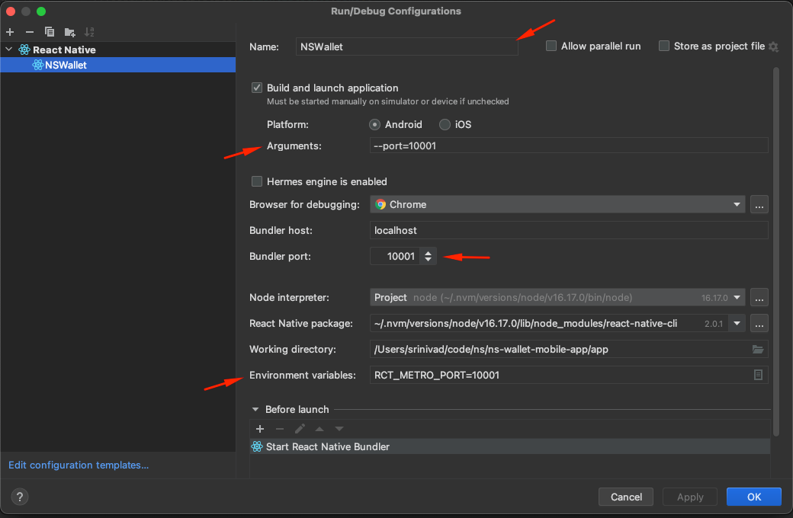
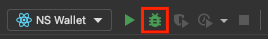
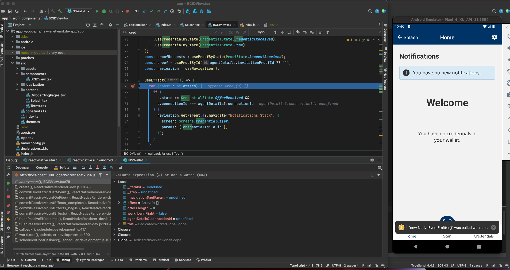
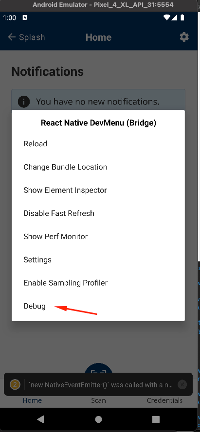

# Developers Guide

- [Prerequisite software](#prerequisite-software)
- [Prerequisite services](#prerequisite-services)
- [Cloning and initializing submodule](#cloning-and-initializing-submodule)
- [React Native setup](#react-native-setup)
- [Installing npm modules](#installing-npm-modules)
- [Configuration](#configuration)
- [Running in an Android emulator](#running-in-an-android-emulator)
- [Troubleshooting and debugging](#troubleshooting-and-debugging)

## Prerequisite software

Before you can proceed with building and testing the BC Wallet app, you must install and configure the following products on your development machine:

- [Git](https://git-scm.com/)
- [Node.js](https://nodejs.org) & [npm](https://docs.npmjs.com/cli/) - (version specified in the `engines` field
  of [./app/package.json](./app/package.json))
  > **Tip**: use [nvm](https://github.com/nvm-sh/nvm) to install node & npm. It helps to easily switch node & npm
  > version for each project.
- [Yarn](https://yarnpkg.com/)
- A [JDK](https://openjdk.org/) and [Gradle](https://gradle.org) - Make sure you install compatible versions, see [here](https://docs.gradle.org/current/userguide/compatibility.html) for more information.
- [Ruby](https://www.ruby-lang.org/en/documentation/installation/) version 2.x.x. You may want/need to use [rbenv](https://github.com/rbenv/rbenv) on MacOS.
- [Bundler](https://bundler.io) version 2 or newer: `sudo gem install bundler:2.1.4`.

## Prerequisite services

Requires the following services to be up and running.

- [Von Network](https://github.com/bcgov/von-network)
- [Mediator Service](https://github.com/hyperledger/aries-mediator-service)

## Cloning and initializing submodule

First clone this repository:

```sh
# Clone your GitHub repository:
git clone https://github.com/bcgov/bc-wallet-mobile.git

# Go to the BC Wallet directory:
cd bc-wallet-mobile
```

## React Native setup

React Native environment setup instructions are documented [here](https://reactnative.dev/docs/environment-setup). Be sure to select the correct React Native version (currently 0.66.x) from the dropdown and to follow the instructions for the React Native CLI. This will guide you through setting up your development environment for your operating system and choice of iOS (only if you are using a Mac) or Android.

Following along, you should end up using Android SDK Platform 33 with Android 13 (API Level 33) for Android development and/or iOS 11 for iOS development.

## Installing npm modules and pods

Next, install the npm modules needed to build and test BC Wallet from the root of the repository:

```sh
# Install BC Wallet project dependencies (package.json) from the root of the cloned repository
yarn install
```

To install pod dependencies:

```sh
   cd app
   bundle install --frozen && pod install
```

To work on changes to BC Wallet in Bifold (the underlying Aries project) you will also need to do the following:

```sh
# from bc-wallet-mobile
git clone git@github.com:hyperledger/aries-mobile-agent-react-native.git bifold 
```

```sh
cd bifold

yarn install

yarn build

cd ..

yarn link bifold --all --relative
```

Once you are happy with your changes to Bifold and have made the relevant PR there, do the following:

```sh
# in bc-wallet-mobile
yarn unlink --all
```

Then once your PR is merged and the packages have been published, make a PR in bc-wallet-mobile with the relevant updated packages installed. The current packages published from Bifold are `@hyperledger/aries-bifold-core`, `@hyperledger/aries-bifold-verifier`, `@hyperledger/aries-oca`, `@hyperledger/aries-bifold-remote-logs`, and `@hyperledger/aries-react-native-attestation`. They are all consumed by bc-wallet-mobile and other projects like it.

## Configuration

In the `./app/` directory copy the .env.sample `cp .env.sample .env`

```
MEDIATOR_URL=<url>
MEDIATOR_USE_PUSH_NOTIFICATIONS=false
```

Push notifications can be used locally if the mediator service has the firebase plugin and it's configured correctly. 

### Adding ledger configurations

To use your locally running instance of `von-network` (or any other Indy ledger that is not pre-configured), you will need to add the appropriate configuration to the `bifold-core/configs/ledgers/indy/ledgers.json` file: add a new block following the pattern used in the file.

For a locally running instance of `von-network`, the genesis transaction list can be obtained by opening a browser at `http://localhost:9000/genesis`.

**Note:** Make sure that the genesis list obtained from the ledger is properly escaped when adding it to `ledgers.json`.

## Running in an Android emulator

During the development process, you may want to run the app in the emulator to see see what it looks like or for some manual testing.

### Creating Android emulator

1. Open <kbd>Android Studio</kbd> -> <kbd> ⠇settings</kbd> -> <kbd> 📲 Virtual Device Manager</kbd> -> <kbd> Create
   Device </kbd>

| Name         | Details                               | Comments                                                                                                          |
| ------------ | ------------------------------------- | ----------------------------------------------------------------------------------------------------------------- |
| Device       | Pixel 4 or Higher (Without PlayStore) | **Note** - To root the emulator you need the one without Play Store. If you want to update the `/etc/hosts` file. |
| System Image | Android 11, API Level - `30`          | **Note** - This should be preselected if you followed along with the React Native setup guide.                    |

2. (Optional) Follow the below instructions to start a rooted Android emulator (Required to be rooted to access the ledger running locally in order to
   update the device's `/etc/hosts` file.). Accessing ledgers available on the internet does not require rooting the device.

   > For more info - [Refer Official Docs - Local Network limitation](https://developer.android.com/studio/run/emulator-networking#networkinglimitations)

   1. List emulator

      ```shell
      emulator -list-avds
      Pixel_4_XL_API_30

      # Note - Your output might be different depending on the AVD you created above.
      ```

   2. Start emulator as writable system
      ```shell
      emulator -avd Pixel_4_XL_API_30 -writable-system -no-snapshot-load
      ```
   3. Open a new terminal session, and run commands described in steps 3, 4 & 5.
      <br> Restart as root user
      ```shell
      adb root
      ```
   4. Remount
      ```shell
      adb -s emulator-5554 remount
      ```
      output:
      ```
      remount succeeded
      ```
   5. Create a file with following host entries. We will copy this file into the emulator.
      1. create a file
      ```shell
      vi myhosts
      ```
      ```shell
      # Enter your local machines IP address. 192.168.0.107 is an example.
      192.168.0.107 host.docker.internal
      # Ensure to add a new line
      ```
      2. Push the file into the emulator
      ```shell
      adb -s emulator-5554 push myhosts /system/etc/hosts
      ```
   6. Verify if the host entries are updated correctly!

      ```shell
       # To Verify
       $ adb shell
       $ cat /etc/hosts

       127.0.0.1       localhost
       ::1             ip6-localhost
       192.168.0.117   host.docker.internal
      ```

   7. Goto Emulator -> ⚙️ <kbd> Settings</kbd> -> 🔒 Security
      1. Set a pin for screen lock
      2. Add a Fingerprint (To enable biometric authentication)
         <br>
   8. Done!

### Running app in Android emulator with Metro

Once you've created and configured your emulator:

```sh
cd app
yarn android
```

Alternatively, you can open `./app/android/` in Android Studio and run the app and emulator from there.

After the initial debug app has been built and deployed to the emulator, you can start the metro bundler:

```sh
cd app
yarn start
```

### Adding QR code to emulator camera view

To place a QR code into the emulators camera view, first ensure you have set the emulators back camera to `VirtualScene`.

Then navigate to `<Android SDK Location>/emulator/resources` and open the `Toren1BD.posters` file in your editor.

Add a line break to the end of that file followed by:

```
poster custom
size 0.8 0.8
position 0 -0.1 -1.8
rotation 0.1 0 0
default custom.png
```

Note: You may have to reboot your emulator once this is complete for it to take effect.

Now, to add any image to the virtual scene (an image of a QR code for example), simply place the image file in this directory with the name `custom.png`

## Troubleshooting and debugging

### Hot reloading

Hot reloading may not work correctly with instantiated Agent objects. Reloading (`r`) or reopening the app may work. Any changes made to native modules require you to re-run the compile step.

### Dependency issues, native module linking issues

If you end up changing dependencies or structures, you may need to perform the following steps:

#### For Android

```sh
rm -rf app/node_modules
yarn install
```

Clean the Android build:

```sh
cd app/android
./gradlew clean
cd ../..
```

Start and clean the Metro cache:

```sh
cd app
yarn start
```

In your second terminal, you can now run:

```sh
cd app
yarn android
```

### Android emulator issues

If the app seems to be hung while loading in your emulator, you made need to reset the connection by running the following in the Android Studio terminal:

```sh
adb reverse tcp:8081 tcp:8081
```

Ensure you have your emulator's front and back camera set to use different sources, as not doing so may cause the emulator to crash whenever the camera is opened.

### Debugging in Intellij and Android Emulator

**UI Inspection:**

1. Install `react-devtools`, if you haven't already
   ```shell
   yarn install -g react-devtools
   ```
2. Run devtools (you can use this only for UI inspections)
   ```
   react-devtools
   ```
3. In a separate terminal, run the following command. To redirect network to react-devtools
   ```shell
   adb reverse tcp:8097 tcp:8097
   ```
   **Debug Application Code in Intellij or WebStorm**
4. Open directory `/app` as project
5. Run/Debug Configuration.

   > [Optional] update the port to `10001`. As the default port `8081` tends to run into
   > conflicts. If you don't have other services running on port 8081. You can skip changing the port

   

6. Start Wallet in Debug Mode. <br>
   

7. Now you can add breakpoint in your IDE.
   
   > Troubleshooting: <br>
   > If debug does not showup. Ensure you have enabled debugging on the device by clicking <kbd>command</kbd> + <kbd>m</kbd>
   > on the device and select <kbd>Debug</kbd>.
   > <br> > 

### Debugging in VSCode and Android Emulator

[](https://www.youtube.com/watch?v=UE66n7HOIAg)
