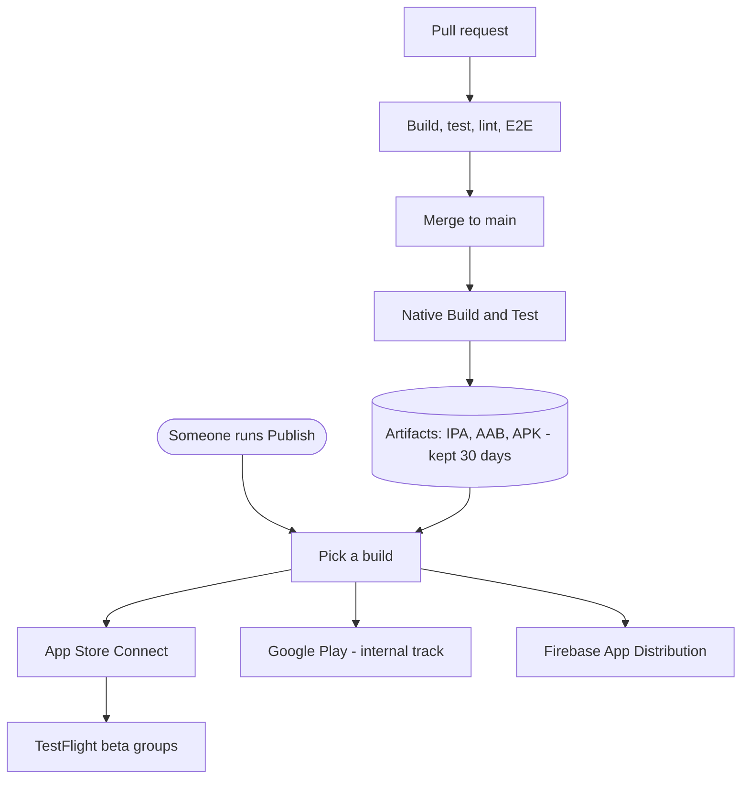

# CI/CD

Two separate things happen to your code. It gets **built and checked**
automatically, and it gets **published** only when a person asks for it.

Nothing reaches testers or the app stores on its own. Merging to `main` produces
build artifacts and stops there.

## On a pull request

`main.yaml` builds iOS and Android for a fast subset of variants, and the
quality workflows run unit tests, linting, type checks and coverage. E2E tests
run on SauceLabs. Nothing is published from a PR.

Only some of these are required to merge — the rest are informational. The
branch ruleset is the source of truth for which.

## On merge to main

The same build workflow runs, this time for **all** variants. It uploads the
IPA, AAB and APK for each one as workflow artifacts, kept for 30 days.

That's the end of it. No store, no testers, no notifications.

## Publishing

Go to **Actions → Publish → Run workflow**. Anyone with write access can run it.

Three optional inputs, all of which can be left alone:

| Input | Leave blank to | Use it to |
|---|---|---|
| `build_number` | Publish the most recent usable main build | Publish an older build |
| `targets` | Publish everywhere | Retry one destination after a partial failure |
| `variants` | Publish every variant in the build | Publish a subset |

The workflow picks a build, downloads that build's artifacts, and uploads them.
It never rebuilds, so what testers install is exactly what CI produced.

"Most recent usable" means the newest `main` run that both succeeded **and**
still has its artifacts. A run can be green with nothing to publish — if a
push's last commit touches no build-relevant files, the build jobs skip and the
run still reports success.

## Where a published build goes

| Destination | Who sees it |
|---|---|
| App Store Connect | Nobody until it's assigned to a TestFlight group |
| TestFlight beta groups | Testers on those groups |
| Google Play internal track | Internal testers |
| Firebase App Distribution | Testers on the configured groups |

## Variants

Each build target — BC Wallet, and BC Services Card across its environments —
is a **variant**, configured in `variants/<name>/variant.env`. That file owns
the app version, bundle IDs, signing references and tester groups.

Publishing reads a variant's config from the commit that produced the build, not
from current `main`, so an older build carries the version it was actually built
with.

## Rings

Distribution groups are moving to a shared ring model across all three stores:
ring 1 for QA, ring 2 for UAT and release candidates, ring 3 for early adopters,
ring 4 for full release. A build is uploaded once and later rings are added to
the existing release rather than re-uploading it.

Not built yet — see #4522.

## The other workflows

| Workflow | What it does |
|---|---|
| `quality.yml` | Unit tests, lint, type check, coverage |
| `e2e.yml` | Reusable E2E suite, called by the build workflow |
| `e2e-nightly.yml` | Scheduled full E2E run |
| `pr-hygiene.yml` | Checks a PR links an issue and fills the template |
| `lockfile-check.yml` | Catches lockfile drift |
| `scanner.yml` | Scans for known malicious packages |
| `update-ledgers.yml` | Keeps Indy ledger config current |
| `maintenance.yml` | Nightly housekeeping |
