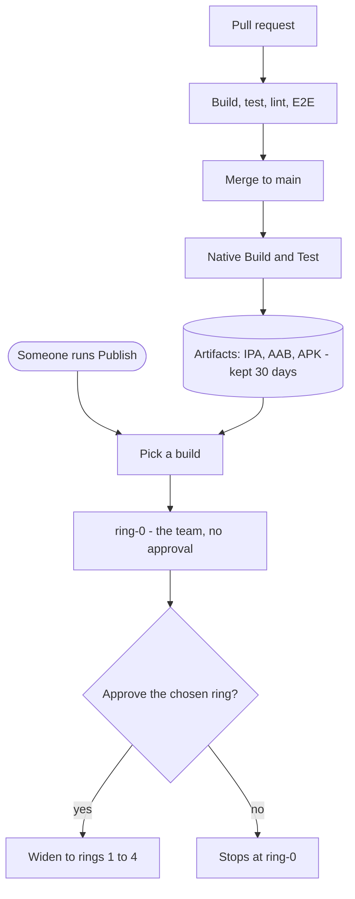

# CI/CD

Two things happen to your code. It gets **built and checked** automatically, and
it gets **published** only when a person asks for it.

Merging to `main` produces build artifacts and stops there. Nothing reaches
testers or the app stores on its own.

## On a pull request

`main.yaml` builds iOS and Android for a fast subset of variants. The quality
workflows run unit tests, linting, type checks and coverage, and E2E tests run
on SauceLabs. Nothing is published from a PR.

Only some of these are required to merge. The branch ruleset is the source of
truth for which.

## On merge to main

The same build workflow runs, this time for **all** variants, and uploads the
IPA, AAB and APK for each one as workflow artifacts kept for 30 days.

That's the end of it. No store, no testers, no notifications.

## Publishing

Go to **Actions → Publish → Run workflow**, pick how far it should go, and run
it. Anyone with write access can start one; only an approver can take it past
ring-0. Publish runs from `main` or a `release/*` branch only.

Publish never builds. It uploads the artifacts an earlier run produced, so what
a tester installs is exactly what CI made.

Full details are in [releases.md](releases.md).

## Rings

A ring is an audience, and the same names are used on Firebase, TestFlight and
Google Play. `ring-0` is the team and always publishes; each ring after it is
wider and needs an approval. Publishing to a ring publishes every ring below it.

A build is uploaded once at ring-0. Later rings widen who can see that same
build rather than uploading it again, so publishing is safe to repeat.

Approvals come from three teams: `bcsc-approvers-ring-1` for QA,
`bcsc-approvers-ring-2` for UAT, and `bcsc-approvers-ring-3-plus` beyond that.

## Variants

Each build target, meaning BC Wallet and BC Services Card across its
environments, is a **variant** configured in `variants/<name>/variant.env`. That
file owns the app version, bundle IDs and signing references.

Publishing reads a variant's config from the commit that produced the build, so
an older build carries the version it was actually built with.

## Picking a build to publish

Publish takes the newest run on the branch that both succeeded **and** still has
its artifacts. A run can be green with nothing to publish: if a push's last
commit touches no build-relevant files, the build jobs skip and the run still
reports success.

iOS and Android build independently, so a run can hold artifacts for one
platform and not the other. Each destination runs only for the variants whose
artifact is there. Anything with nothing to upload is listed in the **Resolve
build** log and shows as a skipped job. A missing artifact for a variant that
was expected fails that job rather than passing quietly.

## The other workflows

| Workflow | What it does |
|---|---|
| `quality.yml` | Unit tests, lint, type check, coverage |
| `e2e.yml` | Reusable E2E suite, called by the build workflow |
| `e2e-nightly.yml` | Scheduled full E2E run |
| `pr-hygiene.yml` | Checks a PR links an issue and fills the template |
| `lockfile-check.yml` | Catches lockfile drift |
| `scanner.yml` | Scans for known malicious packages |
| `update-ledgers.yml` | Keeps Indy ledger config current |
| `maintenance.yml` | Nightly housekeeping |
