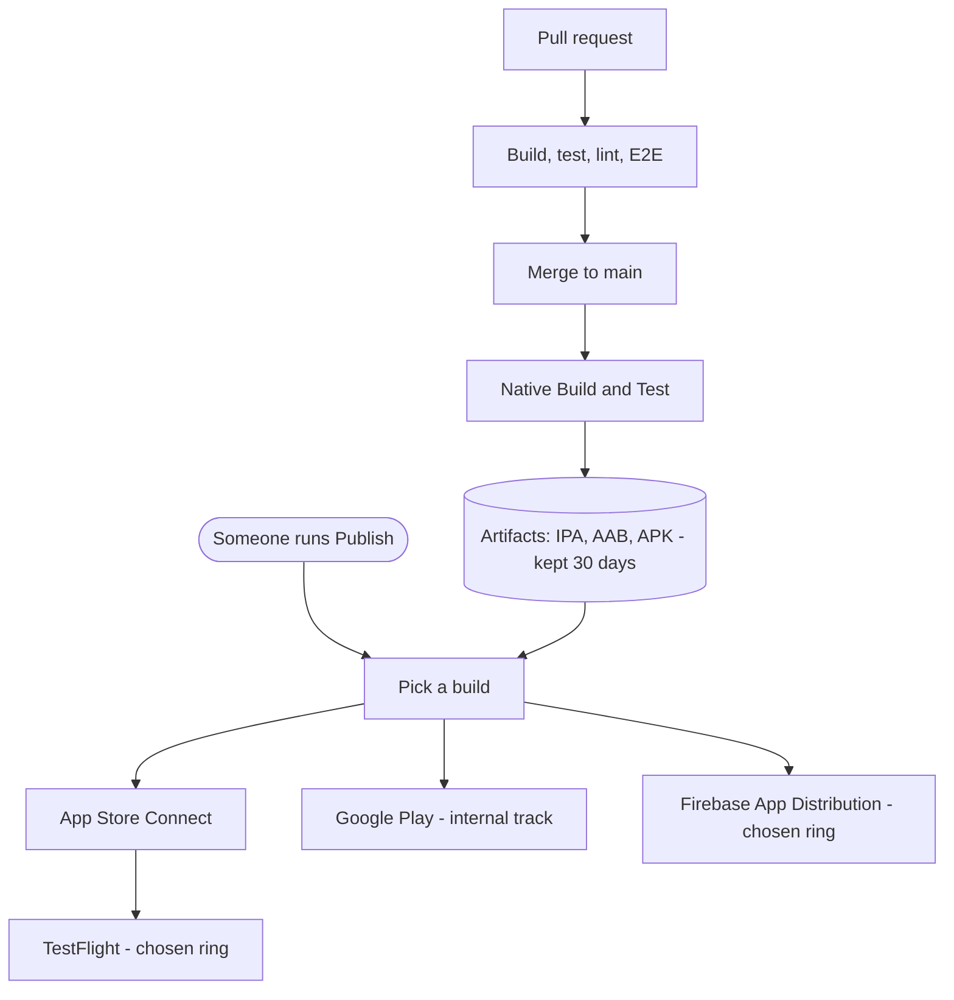

# CI/CD

Two separate things happen to your code. It gets **built and checked**
automatically, and it gets **published** only when a person asks for it.

Nothing reaches testers or the app stores on its own. Merging to `main` produces
build artifacts and stops there.

## On a pull request

`main.yaml` builds iOS and Android for a fast subset of variants, and the
quality workflows run unit tests, linting, type checks and coverage. E2E tests
run on SauceLabs. Nothing is published from a PR.

Only some of these are required to merge — the rest are informational. The
branch ruleset is the source of truth for which.

## On merge to main

The same build workflow runs, this time for **all** variants. It uploads the
IPA, AAB and APK for each one as workflow artifacts, kept for 30 days.

That's the end of it. No store, no testers, no notifications.

## Publishing

Go to **Actions → Publish → Run workflow**, pick a ring, run it. Anyone with
write access can. Publish runs from `main` or a `release/*` branch only.

The workflow picks a build, downloads that build's artifacts, and uploads them.
It never rebuilds, so what testers install is exactly what CI produced.

Full details — rings, inputs, versioning, release branches — are in
[releases.md](releases.md).

"Most recent usable" means the newest run on that branch which both succeeded
**and** still has its artifacts. A run can be green with nothing to publish —
if a push's last commit touches no build-relevant files, the build jobs skip
and the run still reports success.

iOS and Android build independently, so a run can hold artifacts for one
platform and not the other. Each destination runs only for the variants whose
artifact is actually there; anything with nothing to upload is listed as
skipped in the **Resolve build** log and shows as a skipped job. A missing
artifact for a variant that was expected fails that job rather than passing
quietly.

## Variants

Each build target — BC Wallet, and BC Services Card across its environments —
is a **variant**, configured in `variants/<name>/variant.env`. That file owns
the app version, bundle IDs and signing references.

Publishing reads a variant's config from the commit that produced the build, not
from current `main`, so an older build carries the version it was actually built
with.

## Rings

A ring is an audience, and the same ring names are used on Firebase, TestFlight
and Google Play. `ring-0` is the team and is the default; each ring after it is
wider. A build is uploaded once at ring-0, and later rings widen who can see
that same build rather than uploading it again.

See [releases.md](releases.md).

## The other workflows

| Workflow | What it does |
|---|---|
| `quality.yml` | Unit tests, lint, type check, coverage |
| `e2e.yml` | Reusable E2E suite, called by the build workflow |
| `e2e-nightly.yml` | Scheduled full E2E run |
| `pr-hygiene.yml` | Checks a PR links an issue and fills the template |
| `lockfile-check.yml` | Catches lockfile drift |
| `scanner.yml` | Scans for known malicious packages |
| `update-ledgers.yml` | Keeps Indy ledger config current |
| `maintenance.yml` | Nightly housekeeping |
